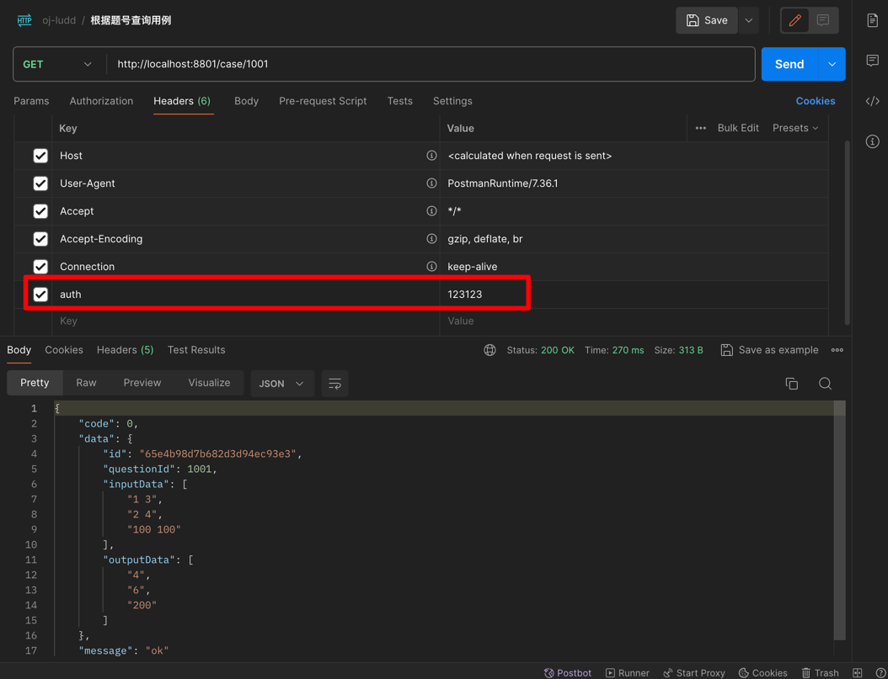

# 项目介绍

&emsp;一个简单的测试用例存储系统，使用MongoDB存储`题目ID、输入数据、输出数据`。

- 支持字符串数组形式上传测试用例。

- 支持`zip`文件上传，命名规范`题号.zip`。内部以`.in`、`.out`文件分别表示输入数据、输出数据;

- 支持根据题号查询测试用例

- 支持根据题号删除测试用例

- 支持简单的身份校验

> 使用AOP对接口进行简单的身份校验。可通过配置文件配置系统密钥

